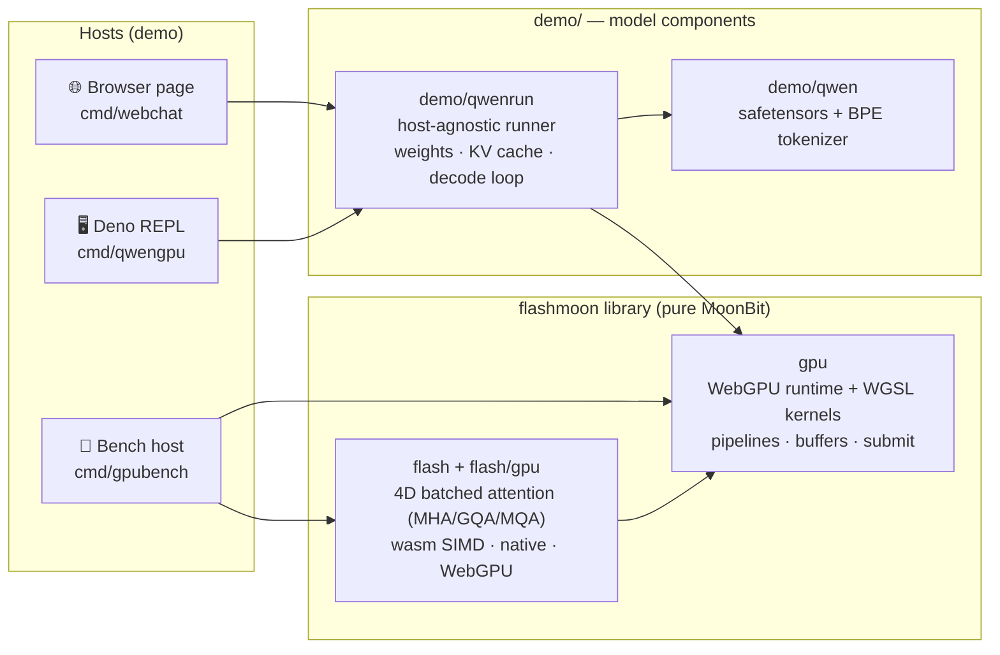

<div align="center">

# ⚡ flashmoon

**A WebGPU-oriented AI inference foundation library in pure MoonBit — GPU runtime & FlashAttention kernels, verified numerics, with full Qwen3-0.6B inference as the downstream proof.**

纯 MoonBit 的 WebGPU AI 推理基础库:GPU 运行时 + FlashAttention 算子 + 可验证数值体系,Qwen3-0.6B 端到端推理([demo/](demo/README.md))为真实下游示例。

[](https://www.moonbitlang.com)
[](https://www.w3.org/TR/webgpu/)
[](LICENSE)

</div>

---

## Why flashmoon

MoonBit 生态缺少面向 GPU 的通用计算与 AI 推理基础设施。flashmoon 以**基础库**形态填补这一空白——两个可独立复用的库包加一个数值验证体系,模型相关内容全部放在 [`demo/`](demo/README.md) 作为下游示例。

- 📐 **`flash` + `flash/gpu`: standalone attention library** — batched 4D MHA/GQA/MQA over `[B,H,S,D]` tensors, bottom-right causal masks, cross-attention with cached KV, arbitrary head dims; f32x4-SIMD wasm/native kernels plus a WebGPU backend. One `moon add`, no framework attached.
- 🎛️ **`gpu`: WebGPU compute runtime** — device/queue management, pipeline cache, single-pass batched submit, zero-copy bf16 weight upload, and a verified WGSL kernel library (flash prefill / flash-decoding / bf16 GEMV·GEMM / fused SiLU·residual·RoPE / GPU argmax).
- 🧮 **Numerics you can trust** — every kernel ships with a CPU/f64 oracle check; the attention library carries randomized property tests against its naive reference. No silent drift.
- 📦 **Zero-dependency core** — the entire GPU path is MoonBit code + WebGPU. No native libs, no Python, no ONNX.

## Use it as a library

```bash
moon add starAndHonor/flashmoon
```

### 4D batched attention — `flash` (wasm/native) + `flash/gpu` (WebGPU)

```moonbit
// CPU: wasm f32x4 SIMD / native scalar
let cfg = @flash.AttnConfig::new(heads=8, kv_heads=2, causal=true) // GQA
let out = @flash.flash_attention(q, k, v, cfg)
//   q [B,8,Sq,D] · k,v [B,2,Skv,D] -> out [B,8,Sq,Dv]

// WebGPU backend (js target), same 4D contract
@flashgpu.flash_attention(g, q, k, v, cfg, fn(out) { ... })
```

MHA/GQA/MQA via `heads`/`kv_heads`; causal masks are bottom-right aligned, so
`Sq < Skv` is attention over cached KV (incremental decode); `scale` defaults
to `1/sqrt(D)`. A naive reference (`@flash.naive_attention`) ships in the same
package for oracle testing.

### WebGPU compute runtime — `gpu` (js target)

```moonbit
@gpu.Gpu::init(fn(g) {
  let qb = g.upload(q_data) // FixedArray[Float] -> GPUBuffer
  let outb = g.alloc(n_out)
  g.attn_4d(qb, kb, vb, outb, b, h, hkv, sq, skv, d, dv, false, scale)
  g.readback(outb, n_out, fn(data) { ... })
})
```

Kernel entry points: `attn_4d` / `flash_attention` (tiled online softmax),
`attn_prefill` / `attn_decode` (flash-decoding split-KV), `matvec` /
`matvec_silu` / `gemv2_fused` (bf16 zero-copy), `matmul`, `rmsnorm` /
`add_rmsnorm`, `rope` / `qknorm_rope`, `silu_mul`, `add`, `embed_rows`,
`argmax` — everything a Transformer forward pass needs.

## Performance

Kernels measured on an RTX 4060 Laptop (release, dispatch-only unless noted):

| Kernel | Result | Shape |
|---|---|---|
| Tiled attention (WebGPU) | **318 GFLOP/s** | 4096×4096, d=64 |
| bf16 GEMV | **2.7 ms (116 GB/s)** | 151936×1024 |
| wasm tiled attention (f32x4 SIMD) | ~5.4 ms | 256×256, d=64, native-wasm |

End-to-end model inference numbers (Qwen3-0.6B, ~90 tok/s in Chromium) live in
[demo/README.md](demo/README.md).

## Quick start

**🔬 Kernel benchmarks** (attention / GEMV / GEMM correctness + throughput, Deno host):

```bash
moon build --target js
deno run --allow-read scripts/webgpu_host.js
```

**🧊 Attention library on wasm/native** (no GPU needed):

```bash
moon test                                  # full suite, incl. property tests
moon run cmd/fa --target wasm              # naive vs flash demo (GQA, causal)
moon run cmd/bench --target wasm --release # attention benchmark harness
```

**💬 LLM chat demo** (browser / Deno REPL, Qwen3-0.6B): see
[demo/README.md](demo/README.md).

## Architecture



> **On the name.** The `flash` library and the WebGPU inference kernels
> implement the FlashAttention-family algorithm — online softmax with
> running max/sum and deferred `1/l` normalization (prefill: tiled K/V
> staging; decode: flash-decoding split-KV + combine). FA2's headline
> contributions are CUDA grid/warp scheduling (Q-parallel thread blocks,
> per-warp Q partitioning), which don't translate to WGSL — so we claim the
> family, not the version.

## Verification

| Check | Result |
|---|---|
| 4D library property tests (GQA/MQA, causal, cross, odd dims; wasm/native) | max diff < 1e-4 |
| WebGPU flash4d vs naive oracle (4 shape configs, real GPU) | max diff ≤ 3.0e-7 |
| WebGPU GEMV / GEMM vs CPU oracle | max diff ≤ 1.6e-5 |
| Kernel unit checks (rmsnorm / rope / silu+add / attn_prefill / attn_decode, f64 oracle) | max diff ≤ 1.2e-7 |
| bf16 storage vs byte loads | equal (exposed byte/bf16 rounding drift, now read-side converted) |

## Repository layout

```
flash/                         4D batched flash attention library (wasm/native, f32x4 SIMD)
flash/gpu/                     WebGPU backend for the flash library (js target)
gpu/                           WebGPU runtime + compute kernels (js target)
demo/                          downstream model components + LLM demo (see demo/README.md)
demo/qwen/                     safetensors parser + Qwen2 byte-level BPE tokenizer
demo/qwenrun/                  Qwen3-0.6B runner core (host-agnostic: read/log injected)
cmd/fa/                        naive-vs-flash attention demo (wasm/native)
cmd/bench/                     attention benchmark harness (wasm)
cmd/gpubench/                  WebGPU kernel checks + benchmarks (Deno host)
cmd/qwencpu/                   Qwen3 CPU reference runner + tokenizer oracle test
cmd/qwengpu/                   Deno REPL chat (MATCH gate + slash commands)
cmd/webchat/                   browser chat page (chat.html + DOM frontend)
test/                          blackbox tests (flash attention, benchmarks, tokenizer oracle)
refs/                          model + HF reference data (gitignored, ~1.5 GB)
scripts/                       Deno host shims (webgpu_host.js, qwengpu_host.js)
```

## License

Apache-2.0 — see [LICENSE](LICENSE).
