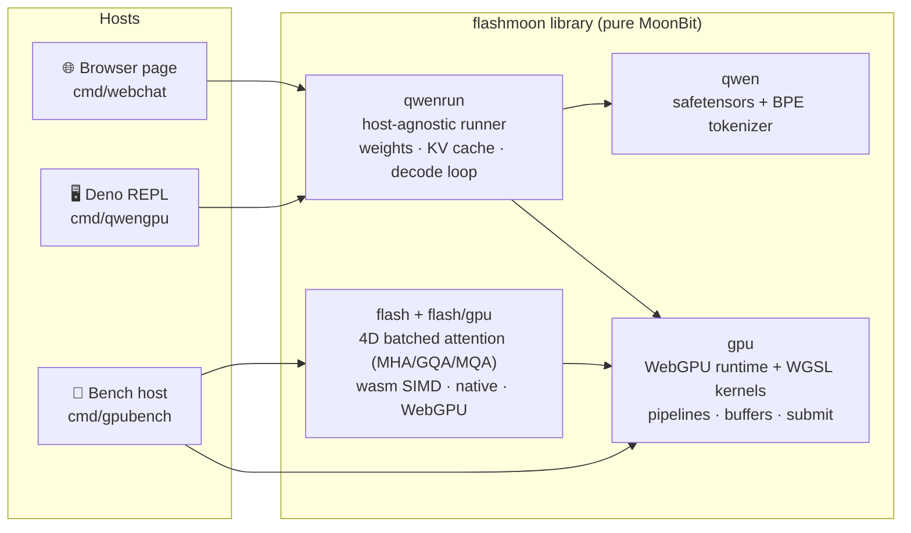

<div align="center">

# ⚡ flashmoon

**A WebGPU-oriented AI inference foundation library in pure MoonBit — GPU runtime, flash attention, model components — with full Qwen3-0.6B inference as the proof.**

纯 MoonBit 的 WebGPU AI 推理基础库:GPU 运行时、FlashAttention 注意力库、模型组件——并以 Qwen3-0.6B 端到端推理(浏览器 / Deno / wasm / native)佐证真实可用。

[](https://www.moonbitlang.com)
[](https://www.w3.org/TR/webgpu/)
[](https://huggingface.co/Qwen/Qwen3-0.6B)
[](LICENSE)


*Built on flashmoon: Qwen3-0.6B chatting in Chromium — weights, tokenizer, kernels and sampler are all MoonBit.*

</div>

---

## Why flashmoon

MoonBit 生态缺少面向 GPU 的通用计算与 AI 推理基础设施。flashmoon 以**基础库**形态填补这一空白——四层可独立复用的组件(`gpu` 运行时 · `flash`/`flash/gpu` 注意力库 · `qwen`/`qwenrun` 模型组件 · 数值验证体系),Qwen3-0.6B 对话应用只是建立在它之上的一个示例。

- 🧮 **Numerics you can trust** — GPU greedy-decode logits are a **byte-exact MATCH** against the CPU reference runner; tokenizer verified against a HuggingFace-generated oracle. No silent drift anywhere in the stack.
- 🚀 **bf16 end-to-end, zero copies** — weights upload as raw bytes; GEMV reads bf16 straight from storage buffers. Layer weights are written **in-place** during upload (no transient copies).
- 🔥 **Flash attention everywhere** — prefill runs a tiled online-softmax kernel (K/V cooperatively staged in shared memory, running max/sum, never materializing scores); decode runs **flash-decoding** (16-way split-KV partials + online-softmax combine, 256 workgroups at rows=1). Plus fused SiLU·residual·RoPE, bf16 GEMV, and a full-logit GPU argmax for greedy decode.
- 📐 **`flash`: a standalone attention library** — batched 4D MHA/GQA/MQA over `[B,H,S,D]` tensors, bottom-right causal masks, cross-attention with cached KV, arbitrary head dims; f32x4-SIMD wasm/native kernels plus a WebGPU backend (`flash/gpu`). One `moon add`, no framework attached.
- 🧱 **One runtime, every host** — the same `qwenrun` core runs in the browser (interactive page), Deno (REPL with a CI-friendly MATCH gate), wasm and native.
- 🎛️ **Real generation controls** — max tokens / temperature / top-k / top-p sliders in the browser, slash commands in the REPL. Greedy path stays pure-GPU; sampling pays one logits readback.
- 📦 **Zero-dependency core** — the entire GPU path is MoonBit code + WebGPU. No native libs, no Python, no ONNX.

## Performance

Measured on an RTX 4060 Laptop (release build, Qwen3-0.6B, short prompts):

| Surface | Prefill | Decode | Notes |
|---|---|---|---|
| **Chromium (WebGPU)** | ~300–410 ms | **~11 ms/tok (~90 tok/s)** greedy | ~36 ms/tok sampling (logits readback) |
| **Deno (WebGPU)** | ~350 ms | ~20 ms/tok greedy | second WGSL→Vulkan adapter layer |
| Tiled attention (WebGPU) | — | **318 GFLOP/s** | 4096×4096, d=64, dispatch-only |
| GEMV 151936×1024 bf16 | — | **2.7 ms (116 GB/s)** | dispatch-only |
| wasm tiled attention (f32x4 SIMD) | — | ~5.4 ms | 256×256, d=64, native-wasm |

## Use it as a library

```moonbit
// CPU (wasm f32x4 SIMD / native scalar), moon add starAndHonor/flashmoon
let cfg = @flash.AttnConfig::new(heads=8, kv_heads=2, causal=true) // GQA
let out = @flash.flash_attention(q, k, v, cfg)
//   q [B,8,Sq,D] · k,v [B,2,Skv,D] -> out [B,8,Sq,Dv]

// WebGPU backend (js target)
@flashgpu.flash_attention(g, q, k, v, cfg, fn(out) { ... })
```

Naive-vs-flash numerical oracle included (`@flash.naive_attention`); causal
masks are bottom-right aligned, so `Sq < Skv` is attention over cached KV.

## Quick start

> Requires the model at `refs/Qwen3-0.6B/model.safetensors`
> (download from [HuggingFace](https://huggingface.co/Qwen/Qwen3-0.6B)).

**💬 Browser chat**

```bash
moon build --target js
python3 -m http.server 8123
# Chrome / Edge with WebGPU →
open http://127.0.0.1:8123/cmd/webchat/chat.html
```

Drag the sliders (max / temp / top-k / top-p), press Send. `temp = 0` means greedy.

**🖥️ Deno REPL**

```bash
moon build --target js
deno run --allow-read scripts/qwengpu_host.js
```

| Command | Effect |
|---|---|
| `/max N` `/temp F` `/topk K` `/topp F` | set generation hyperparameters |
| `/greedy` | back to pure-GPU argmax |
| `quit` | exit |

**🔬 Kernel benchmarks** (attention / GEMV correctness + throughput)

```bash
deno run --allow-read scripts/webgpu_host.js
```

**🧊 FlashAttention on wasm/native** (no GPU needed)

```bash
moon test                                  # full suite, incl. tokenizer oracle
moon run cmd/fa --target wasm              # naive vs flash demo
moon run cmd/bench --target wasm --release # attention benchmark harness
```

## Architecture



Decode-critical invariants: f32-resident KV cache, RoPE fused on write, in-place
SiLU+residual, single-submit argmax — **only logits-per-token and final text
cross the GPU↔CPU boundary**.

> **On the name.** The `flash` library and both WebGPU inference kernels
> implement the FlashAttention-family algorithm — online softmax with
> running max/sum and deferred `1/l` normalization (prefill: tiled K/V
> staging; decode: flash-decoding split-KV + combine). FA2's headline
> contributions are CUDA grid/warp scheduling (Q-parallel thread blocks,
> per-warp Q partitioning), which don't translate to WGSL — so we claim the
> family, not the version.

## Verification

| Check | Result |
|---|---|
| Kernel unit checks (rmsnorm / rope / silu+add / attn_prefill / attn_decode) | max diff ≤ 1.2e-7 |
| Tokenizer vs HuggingFace oracle | exact ID match |
| wasm tiled attention vs naive attention | max diff ≤ 5e-5 |
| 4D library property tests (GQA/MQA, causal, cross, odd dims; wasm/native) | max diff < 1e-4 |
| WebGPU flash4d vs naive oracle (4 shape configs, real GPU) | max diff ≤ 3.0e-7 |
| bf16 storage vs byte loads | equal (exposed byte/bf16 rounding drift, now read-side converted) |

The Deno REPL's MATCH gate compares the first token ID against the CPU
reference on every startup — regressions fail loudly.

## Repository layout

```
flash/                         4D batched flash attention library (wasm/native, f32x4 SIMD)
flash/gpu/                     WebGPU backend for the flash library (js target)
gpu/                           WebGPU runtime + compute kernels (js target)
qwen/                          safetensors parser + Qwen2 byte-level BPE tokenizer
qwenrun/                       Qwen3-0.6B runner core (host-agnostic: read/log injected)
cmd/fa/                        naive-vs-flash attention demo (wasm/native)
cmd/bench/                     attention benchmark harness (wasm)
cmd/gpubench/                  WebGPU kernel checks + benchmarks (Deno host)
cmd/qwencpu/                   Qwen3 CPU reference runner + tokenizer oracle test
cmd/qwengpu/                   Deno REPL chat (MATCH gate + slash commands)
cmd/webchat/                   browser chat page (chat.html + DOM frontend)
test/                          all blackbox tests (flash attention, benchmarks, tokenizer oracle)
docs/                          screenshots
refs/                          model + HF reference data (gitignored, ~1.5 GB)
scripts/                       Deno host shims (webgpu_host.js, qwengpu_host.js)
```

## Known limitations

- Qwen3-0.6B only (architecture-general; weights/config hardcoded).
- Context capped at 2048 positions (KV-cache sizing constant `MAXPOS`; the flash kernels impose no score-scratch limit, so raising it is a one-line change plus re-test).
- No continuous batching / speculative decode; single sequence.
- Sampling reads the full logits back to CPU each token (~2.7× decode cost).

## License

Apache-2.0 — see [LICENSE](LICENSE).
