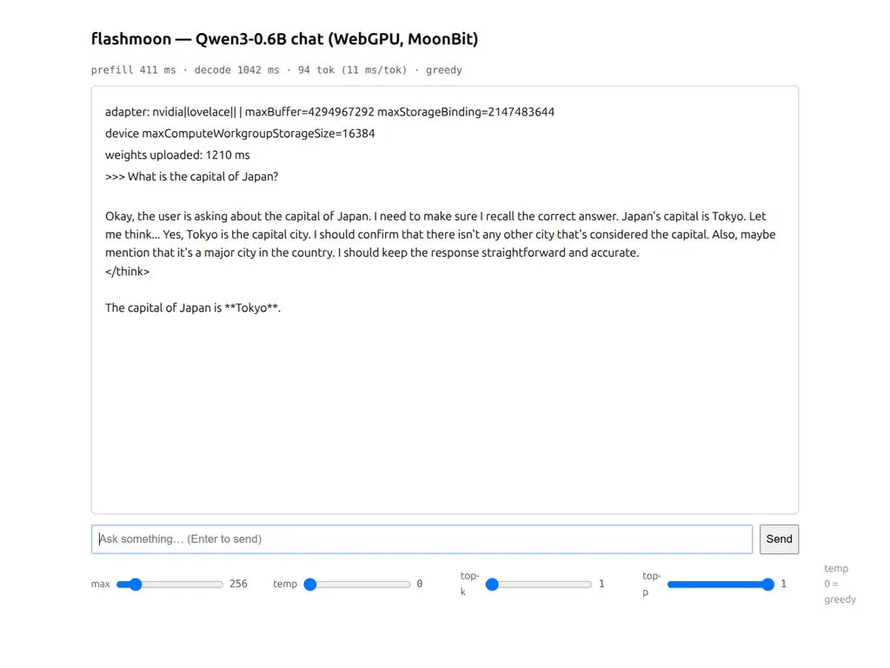
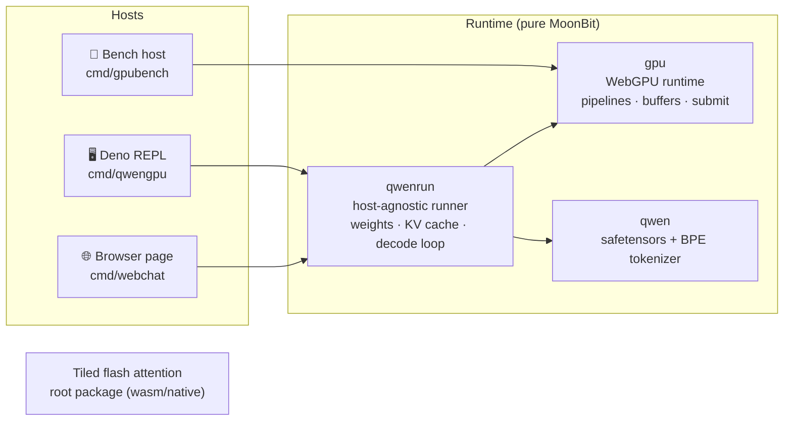

<div align="center">

# ⚡ flashmoon

**FlashAttention-style attention & full LLM inference, written in pure MoonBit, running on your GPU via WebGPU.**

纯 MoonBit 实现的 FlashAttention 式分块注意力与端到端大模型推理——从 wasm 到浏览器里的真实 GPU。

[](https://www.moonbitlang.com)
[](https://www.w3.org/TR/webgpu/)
[](https://huggingface.co/Qwen/Qwen3-0.6B)
[](LICENSE)



*Qwen3-0.6B chatting in Chromium — weights, tokenizer, kernels and sampler are all MoonBit.*

</div>

---

## Why flashmoon

- 🧮 **Numerics you can trust** — GPU greedy-decode logits are a **byte-exact MATCH** against the CPU reference runner; tokenizer verified against a HuggingFace-generated oracle. No silent drift anywhere in the stack.
- 🚀 **bf16 end-to-end, zero copies** — weights upload as raw bytes; GEMV reads bf16 straight from storage buffers. Layer weights are written **in-place** during upload (no transient copies).
- 🔥 **Hand-tuned WGSL kernels** — per-(row, head) attention with scores staged in workgroup SRAM, fused SiLU·residual·RoPE, bf16 GEMV, and a full-logit GPU argmax for greedy decode. Flash-style tiled kernels (online softmax, K/V shared-memory tiles) ship in `cmd/gpubench` but are not yet wired into the LLM path.
- 🧱 **One runtime, every host** — the same `qwenrun` core runs in the browser (interactive page), Deno (REPL with a CI-friendly MATCH gate), wasm and native.
- 🎛️ **Real generation controls** — max tokens / temperature / top-k / top-p sliders in the browser, slash commands in the REPL. Greedy path stays pure-GPU; sampling pays one logits readback.
- 📦 **Zero-dependency core** — the entire GPU path is MoonBit code + WebGPU. No native libs, no Python, no ONNX.

## Performance

Measured on an RTX 4060 Laptop (release build, Qwen3-0.6B, short prompts):

| Surface | Prefill | Decode | Notes |
|---|---|---|---|
| **Chromium (WebGPU)** | ~300–410 ms | **~11 ms/tok (~90 tok/s)** greedy | ~36 ms/tok sampling (logits readback) |
| **Deno (WebGPU)** | ~350 ms | ~20 ms/tok greedy | second WGSL→Vulkan adapter layer |
| Tiled attention (WebGPU) | — | **318 GFLOP/s** | 4096×4096, d=64, dispatch-only |
| GEMV 151936×1024 bf16 | — | **2.7 ms (116 GB/s)** | dispatch-only |
| wasm tiled attention (f32x4 SIMD) | — | ~5.4 ms | 256×256, d=64, native-wasm |

## Quick start

> Requires the model at `refs/Qwen3-0.6B/model.safetensors`
> (download from [HuggingFace](https://huggingface.co/Qwen/Qwen3-0.6B)).

**💬 Browser chat**

```bash
moon build --target js
python3 -m http.server 8123
# Chrome / Edge with WebGPU →
open http://127.0.0.1:8123/cmd/webchat/chat.html
```

Drag the sliders (max / temp / top-k / top-p), press Send. `temp = 0` means greedy.

**🖥️ Deno REPL**

```bash
moon build --target js
deno run --allow-read scripts/qwengpu_host.js
```

| Command | Effect |
|---|---|
| `/max N` `/temp F` `/topk K` `/topp F` | set generation hyperparameters |
| `/greedy` | back to pure-GPU argmax |
| `quit` | exit |

**🔬 Kernel benchmarks** (attention / GEMV correctness + throughput)

```bash
deno run --allow-read scripts/webgpu_host.js
```

**🧊 FlashAttention on wasm/native** (no GPU needed)

```bash
moon test                                  # full suite, incl. tokenizer oracle
moon run cmd/fa --target wasm              # naive vs flash demo
moon run cmd/bench --target wasm --release # attention benchmark harness
```

## Architecture



Decode-critical invariants: f32-resident KV cache, RoPE fused on write, in-place
SiLU+residual, single-submit argmax — **only logits-per-token and final text
cross the GPU↔CPU boundary**.

> **On the name.** The repo contains FlashAttention-family kernels (tiled
> online softmax, running max/sum, deferred `1/l` normalization): the wasm
> root package and the WebGPU tiled kernel in `cmd/gpubench`. FA2's headline
> contributions are CUDA grid/warp scheduling (Q-parallel thread blocks,
> per-warp Q partitioning), which don't translate to these ports — so we
> don't claim the name. The Qwen3 inference path itself currently uses a
> simpler per-(row, head) kernel with scores staged in workgroup SRAM; wiring
> the flash kernels into prefill/decode is future work.

## Verification

| Check | Result |
|---|---|
| Greedy logits, GPU vs CPU reference | **byte-exact MATCH** |
| Kernel unit checks (rmsnorm / rope / silu+add / attn_rows) | max diff ≤ 1.2e-7 |
| Tokenizer vs HuggingFace oracle | exact ID match |
| wasm tiled attention vs naive attention | max diff ≤ 5e-5 |
| bf16 storage vs byte loads | equal (exposed byte/bf16 rounding drift, now read-side converted) |

The Deno REPL's MATCH gate compares the first token ID against the CPU
reference on every startup — regressions fail loudly.

## Repository layout

```
flashmoon.mbt / kernel_*.mbt   tiled flash attention (wasm/native, f32x4 SIMD) — root package
gpu/                           WebGPU runtime + compute kernels (js target)
qwen/                          safetensors parser + Qwen2 byte-level BPE tokenizer
qwenrun/                       Qwen3-0.6B runner core (host-agnostic: read/log injected)
cmd/fa/                        naive-vs-flash attention demo (wasm/native)
cmd/bench/                     attention benchmark harness (wasm)
cmd/gpubench/                  WebGPU kernel checks + benchmarks (Deno host)
cmd/qwencpu/                   Qwen3 CPU reference runner + tokenizer oracle test
cmd/qwengpu/                   Deno REPL chat (MATCH gate + slash commands)
cmd/webchat/                   browser chat page (chat.html + DOM frontend)
docs/                          screenshots
refs/                          model + HF reference data (gitignored, ~1.5 GB)
scripts/                       Deno host shims (webgpu_host.js, qwengpu_host.js)
```

## Known limitations

- Qwen3-0.6B only (architecture-general; weights/config hardcoded).
- Context capped at 2048 positions (KV buffer fixed at load).
- No continuous batching / speculative decode; single sequence.
- Sampling reads the full logits back to CPU each token (~2.7× decode cost).

## License

Apache-2.0 — see [LICENSE](LICENSE).
