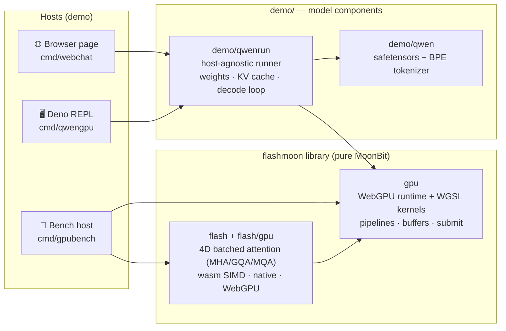

<div align="center">

# ⚡ flashmoon

**A pure-MoonBit WebGPU runtime and inference kernel library — WGSL kernels & 4D batched FlashAttention, verified numerics, with full Qwen3-0.6B inference as the downstream proof.**

纯 MoonBit 的 WebGPU AI 推理基础库:GPU 运行时 + FlashAttention 算子 + 可验证数值体系,Qwen3-0.6B 端到端推理([demo/](demo/README.md))为真实下游示例。

[](https://www.moonbitlang.com)
[](https://www.w3.org/TR/webgpu/)
[](LICENSE)

</div>

---

## Why flashmoon

MoonBit 生态缺少面向 GPU 的通用计算与 AI 推理基础设施。flashmoon 以**基础库**形态填补这一空白——两个可独立复用的库包加一个数值验证体系,模型相关内容全部放在 [`demo/`](demo/README.md) 作为下游示例。

- 📐 **`flash` + `flash/gpu`: standalone attention library** — batched 4D MHA/GQA/MQA over `[B,H,S,D]` tensors, bottom-right causal masks, cross-attention with cached KV, arbitrary head dims; f32x4-SIMD wasm/native kernels plus a WebGPU backend. One `moon add`, no framework attached.
- 🎛️ **`gpu`: WebGPU compute runtime** — device/queue management, pipeline cache, single-pass batched submit, zero-copy bf16 weight upload, and a verified WGSL kernel library (flash prefill / flash-decoding / bf16 GEMV·GEMM / fused SiLU·residual·RoPE / GPU argmax).
- 🧮 **Numerics you can trust** — every kernel ships with a CPU/f64 oracle check; the attention library carries randomized property tests against its naive reference. No silent drift.
- 📦 **Zero-dependency core** — the entire GPU path is MoonBit code + WebGPU. No native libs, no Python, no ONNX.

## Use it as a library

```bash
moon add starAndHonor/flashmoon
```

| Import | What you get | Targets |
|---|---|---|
| `starAndHonor/flashmoon/flash` | 4D batched attention (MHA/GQA/MQA, causal, cross-attention, any head dim) + naive oracle | wasm (f32x4 SIMD), native, js |
| `starAndHonor/flashmoon/flash/gpu` | the same 4D contract, dispatched on WebGPU | js |
| `starAndHonor/flashmoon/gpu` | WebGPU runtime (device, pipeline cache, buffers, submit) + the WGSL kernel library | js |

### 1. Batched attention — `flash`

Tensors are 4D row-major, f32:

```
q   [B, H,   Sq, D ]      out [B, H, Sq, DV]
k   [B, HKV, Skv, D ]
v   [B, HKV, Skv, DV]     out[b,h,i,:] = softmax(q[b,h,i,:] · k[b,kvh,:,:]ᵀ · scale) · v[b,kvh,:,:]
```

```moonbit
import { "starAndHonor/flashmoon/flash" }

let cfg = @flash.AttnConfig::new(
  heads=8,          // query heads H
  kv_heads=2,       // key/value heads HKV: H -> MHA, H/n -> GQA, 1 -> MQA
  causal=true,      // bottom-right-aligned causal mask
  scale=None,       // None = 1/sqrt(D); Some(x) to override
)
let out = @flash.flash_attention(q, k, v, cfg, block_rows=64, block_cols=64)
```

| API | Notes |
|---|---|
| `AttnConfig::new(heads~, kv_heads?=heads, causal?=false, scale?=None)` | `kv_heads` must divide `heads`; aborts otherwise |
| `flash_attention(q, k, v, cfg, block_rows?=64, block_cols?=64)` | tiled online softmax; returns a new `NpArray` |
| `naive_attention(q, k, v, cfg)` | materializes the score matrix; same result, used as the test oracle |

**Semantics worth knowing**

- **Causal is bottom-right aligned**: row `i` attends keys `0 ..= i + Skv - Sq`.
  So `Sq == Skv` is ordinary self-attention, `Sq < Skv` is attention over a
  cached KV prefix (incremental decode), and `Sq > Skv` with `causal=true` is
  rejected (`abort`).
- **GQA/MQA** repeat each KV head across `H / HKV` query heads; `kv_heads` here
  is the *shape* of `k`/`v`, and must match `cfg`.
- **Head dims are arbitrary** (`D` and `DV` may differ, no alignment required) —
  the SIMD kernels have a scalar tail. `block_rows`/`block_cols` are tuning
  knobs only; results are identical up to float summation order (measured
  ≤ 6e-6 at 4096², see [Performance](#performance)).
- **Validation is fail-fast**: dims, batch, head counts and `Skv >= Sq` are
  checked on entry and reported via `abort` with the offending numbers.
- Scale defaults to `1/sqrt(D)`; the config is shared by the WebGPU backend, so
  the same `cfg` gives the same math on both.

Runnable: `moon run examples/attn_cpu --target wasm --release` (GQA + causal,
flash vs naive, prints both outputs and the max diff).

### 2. WebGPU attention — `flash/gpu`

Same 4D contract, one call. It uploads `q`/`k`/`v`, dispatches the tiled kernel
and hands the result back as an `NpArray` (async callback):

```moonbit
import {
  "starAndHonor/flashmoon/flash",
  "starAndHonor/flashmoon/flash/gpu" @flashgpu,
  "starAndHonor/flashmoon/gpu",
}

@gpu.Gpu::init(fn(g) {
  @flashgpu.flash_attention(g, q, k, v, cfg, fn(out) {
    // out : NpArray [B, H, Sq, DV]
  })
}, log=println)
```

Limits (checked, `abort` on violation): `D, DV <= 128`, `Skv >= Sq` when
causal, `B*H <= 65535`, and the K/V tiles must fit workgroup storage
(`8*(D+DV)*4` bytes ≤ device limit; 16 KB on current hardware).

### 3. WebGPU runtime — `gpu`

Use this when the tensors already live on the GPU (timing, layer fusion, model
runners) or when you need a kernel the attention library doesn't cover.

```moonbit
let qb = g.upload(q_data)              // FixedArray[Float] -> GPUBuffer
let outb = g.alloc(b * h * sq * dv)    // f32 storage buffer
let scale = 1.0 / d.to_double().sqrt()
g.attn_4d(qb, kb, vb, outb, b, h, hkv, sq, skv, d, dv, /* causal */ true, scale)
g.sync(fn(_) { ... })                  // wait for the queue
g.readback(outb, n, fn(data) { ... })  // GPUBuffer -> FixedArray[Float]
```

`Gpu::init(cb, log=)` acquires the device once per session; `Gpu::begin()` /
`Gpu::flush()` batch many dispatches into **one** compute pass (per-pass
overhead dominates on Dawn); `sync` / `readback` are async callbacks.

Kernel entry points — everything a Transformer forward pass needs:

| Kernel | Purpose |
|---|---|
| `attn_4d` / `attn_naive_4d` | 4D flash attention / materialized-score baseline |
| `attn_prefill` / `attn_decode` | runner-shaped attention: prefill + split-KV flash-decoding |
| `matvec`, `matvec_silu`, `gemv2_fused` | bf16 GEMV (weights read from storage buffers in place) |
| `matmul` | f32 GEMM |
| `rmsnorm`, `add_rmsnorm` | normalization (optionally fused with a residual add) |
| `rope`, `qknorm_rope` | RoPE, optionally fused with QK-norm and KV-cache write |
| `silu_mul`, `add`, `embed_rows` | elementwise / embedding gather |
| `argmax` | full-logit GPU argmax (greedy decode without a logits readback) |
| `copy`, `set_u32`, `alloc_u32`, `upload_u32` | plumbing (offsets, parameters, splits) |

Large weights bypass the MoonBit array size cap via the raw paths:
`upload_raw(bytes, off, byte_len)` (bf16 bytes straight into storage) and
`upload_typed(F32Buf)` (an already-converted `Float32Array`).

### Runnable examples

| Command | Shows |
|---|---|
| `moon run examples/attn_cpu --target wasm` | 4D GQA + causal on the CPU, flash vs naive |
| `moon build --target js && deno run --allow-read scripts/attn_gpu_host.js` | the same on WebGPU (`flash/gpu` wrapper **and** device-level `attn_4d`), checked against the CPU oracle |
| `moon run cmd/fa --target wasm` | slightly larger demo, prints both outputs |
| `moon run bench --target wasm --release` | naive-vs-flash scenario suite + tile/length/head-dim sweeps |
| `moon build --target js && deno run --allow-read scripts/bench_gpu_host.js` | naive-vs-flash on the GPU |
| `moon build --target js && deno run --allow-read scripts/webgpu_host.js` | per-kernel correctness + throughput checks |

## Performance

### GPU: naive vs flash (WebGPU, RTX 4060 Laptop, 64×64 tiles)

`moon build --target js && deno run --allow-read scripts/bench_gpu_host.js` —
a naive GPU kernel that materializes the Sq×Skv score matrix in global memory
vs the tiled flash kernel that never materializes it (same 4D contract, min
per-dispatch time over 3 rounds, diff against the CPU oracle).

| Scenario | Shape (B×H/Hkv Sq×Skv×D) | naive | flash | speedup | max diff |
|---|---|---|---|---|---|
| chat prompt | 1×8/8 256×256×64 | 1.38 ms | 0.99 ms | 1.40× | 5.4e-7 |
| long prefill | 1×8/8 2048×2048×64 | 22.38 ms | 16.40 ms | 1.36× | 1.6e-6 |
| decode step (KV 2k) | 1×8/8 1×2048×64 | 3.31 ms | 1.38 ms | 2.41× | 1.4e-6 |
| GQA decode (KV 4k) | 1×8/2 1×4096×64 | 6.37 ms | 2.52 ms | 2.52× | 3.6e-6 |
| MQA decode (KV 4k) | 1×8/1 1×4096×64 | 5.31 ms | 2.52 ms | 2.11× | 3.7e-6 |
| batched prefill b4 | 4×8/8 256×256×64 | 4.51 ms | 3.85 ms | 1.17× | 6.0e-7 |
| cached cross-attn | 1×8/8 64×1024×64 | 2.55 ms | 1.36 ms | 1.88× | 9.8e-7 |
| wide head d=128 | 1×8/8 1024×1024×128 | 47.80 ms | 16.29 ms | 2.93× | 1.7e-6 |
| odd dims (d80/dv96) | 1×4/2 512×512×80 | 3.70 ms | 2.33 ms | 1.59× | 7.2e-7 |

Flash wins 1.17–2.93× on GPU, peaking at **524 GFLOP/s** (long prefill 2k).
The gap is widest where the score matrix is large (wide head, decode re-reading
V) and smallest for small shapes, where both kernels are launch-bound.

### CPU: naive vs flash — `moon run bench --target wasm --release`

| Scenario | Shape (B×H/Hkv Sq×Skv×D) | naive | flash | speedup | max diff |
|---|---|---|---|---|---|
| chat prompt | 1×8/8 256×256×64 | 7.98 ms | 8.36 ms | 0.96× | 6.6e-7 |
| long prefill | 1×8/8 2048×2048×64 | 497.98 ms | 488.79 ms | 1.02× | 3.2e-6 |
| decode step (KV 2k) | 1×8/8 1×2048×64 | 2.95 ms | 3.06 ms | 0.96× | 2.1e-6 |
| GQA decode (KV 4k) | 1×8/2 1×4096×64 | 2.20 ms | 2.28 ms | 0.97× | 4.6e-6 |
| MQA decode (KV 4k) | 1×8/1 1×4096×64 | 1.48 ms | 1.61 ms | 0.92× | 4.6e-6 |
| batched prefill b4 | 4×8/8 256×256×64 | 33.86 ms | 34.94 ms | 0.97× | 6.6e-7 |
| cached cross-attn | 1×8/8 64×1024×64 | 16.11 ms | 16.66 ms | 0.97× | 1.7e-6 |
| wide head | 1×8/8 1024×1024×128 | 213.19 ms | 217.23 ms | 0.98× | 2.4e-6 |
| odd dims (d80/dv96) | 1×4/2 512×512×80 | 20.04 ms | 20.31 ms | 0.99× | 1.0e-6 |

All causal, 64×64 tiles, wasm release, min of 3 runs. On the CPU targets both
paths run through the same dot/axpy kernels (wasm: f32x4 SIMD; native: scalar
fallback), so throughput is on par — wasm 0.92–1.02× at ~8.6 GFLOP/s, native
0.93–1.00× at ~1.3 GFLOP/s, with identical output. The tiled kernel's payoff is
memory locality: it materializes no score matrix, which is what pays off on the
GPU. `bench/` also sweeps sequence length (128→4096), head dim (32/64/128) and
tile size (16→256), and runs on native with `--target native`.

### Kernels (RTX 4060 Laptop, release, dispatch-only unless noted)

| Kernel | Result | Shape |
|---|---|---|
| Tiled attention (WebGPU) | **322 GFLOP/s** | 4096×4096, d=64, dispatch-only (gpubench) |
| bf16 GEMV | **2.7 ms (116 GB/s)** | 151936×1024 |
| wasm tiled attention (f32x4 SIMD) | ~5.4 ms | 256×256, d=64, native-wasm |

End-to-end model inference numbers (Qwen3-0.6B, ~90 tok/s in Chromium) live in
[demo/README.md](demo/README.md).

## Quick start

**🔬 Kernel benchmarks** (attention / GEMV / GEMM correctness + throughput, Deno host):

```bash
moon build --target js
deno run --allow-read scripts/webgpu_host.js      # kernel checks + throughput
deno run --allow-read scripts/bench_gpu_host.js   # naive vs flash scenario bench
```

**🧊 Attention library on wasm/native** (no GPU needed):

```bash
moon test                                  # full suite, incl. property tests
moon run examples/attn_cpu --target wasm   # minimal 4D GQA + causal example
```

More runnable entry points: see [Runnable examples](#runnable-examples).

**💬 LLM chat demo** (browser / Deno REPL, Qwen3-0.6B): see
[demo/README.md](demo/README.md).

## Architecture



> **On the name.** The `flash` library and the WebGPU inference kernels
> implement the FlashAttention-family algorithm — online softmax with
> running max/sum and deferred `1/l` normalization (prefill: tiled K/V
> staging; decode: flash-decoding split-KV + combine). FA2's headline
> contributions are CUDA grid/warp scheduling (Q-parallel thread blocks,
> per-warp Q partitioning), which don't translate to WGSL — so we claim the
> family, not the version.

## Verification

| Check | Result |
|---|---|
| 4D library property tests (GQA/MQA, causal, cross, odd dims; wasm/native) | max diff < 1e-4 |
| WebGPU flash4d vs naive oracle (4 shape configs, real GPU) | max diff ≤ 3.0e-7 |
| WebGPU GEMV / GEMM vs CPU oracle | max diff ≤ 1.6e-5 |
| Kernel unit checks (rmsnorm / rope / silu+add / attn_prefill / attn_decode, f64 oracle) | max diff ≤ 1.2e-7 |
| bf16 storage vs byte loads | equal (exposed byte/bf16 rounding drift, now read-side converted) |

## Repository layout

```
flash/                         4D batched flash attention library (wasm/native, f32x4 SIMD)
flash/gpu/                     WebGPU backend for the flash library (js target)
gpu/                           WebGPU runtime + compute kernels (js target)
demo/                          downstream model components + LLM demo (see demo/README.md)
demo/qwen/                     safetensors parser + Qwen2 byte-level BPE tokenizer
demo/qwenrun/                  Qwen3-0.6B runner core (host-agnostic: read/log injected)
examples/                      standalone library usage examples (CPU + WebGPU)
bench/                         naive-vs-flash scenario suite + sweeps (wasm/native)
bench/gpu/                     naive-vs-flash GPU bench (js/WebGPU, Deno host)
cmd/fa/                        naive-vs-flash attention demo (wasm/native)
cmd/gpubench/                  WebGPU kernel checks + benchmarks (Deno host)
cmd/qwencpu/                   Qwen3 CPU reference runner + tokenizer oracle test
cmd/qwengpu/                   Deno REPL chat (MATCH gate + slash commands)
cmd/webchat/                   browser chat page (chat.html + DOM frontend)
test/                          blackbox tests (flash attention, benchmarks, tokenizer oracle)
refs/                          model + HF reference data (gitignored, ~1.5 GB)
scripts/                       Deno host shims (webgpu_host.js, bench_gpu_host.js, attn_gpu_host.js, qwengpu_host.js)
```

## References & licenses

All MoonBit code, WGSL kernels and host shims in this repository are original
work — not a line-by-line port. The following public work was referenced:

| Source | Used for | License |
|---|---|---|
| FlashAttention / FlashAttention-2 papers (Dao et al., 2022/2023, [arXiv:2205.14135](https://arxiv.org/abs/2205.14135), [arXiv:2307.08691](https://arxiv.org/abs/2307.08691)) | online-softmax tiling algorithm and kernel structure (`flash`, `gpu` attention kernels) | — |
| [Dao-AILab/flash-attention](https://github.com/Dao-AILab/flash-attention) | algorithm reference for the CUDA kernel layout | BSD-3-Clause |
| [Qwen/Qwen3-0.6B](https://huggingface.co/Qwen/Qwen3-0.6B) | model weights + tokenizer config used by the `demo/` runner | Apache-2.0 |
| [moonxi-net](https://github.com/chnlkw/moonxi-net) | `NpArray` tensor type backing the `flash` package | Apache-2.0 |

FA2's headline contributions are CUDA grid/warp scheduling (Q-parallel thread
blocks, per-warp Q partitioning), which do not translate to WGSL — the tiled
kernels here claim the FlashAttention family, not a specific version.

## License

Apache-2.0 — see [LICENSE](LICENSE).
